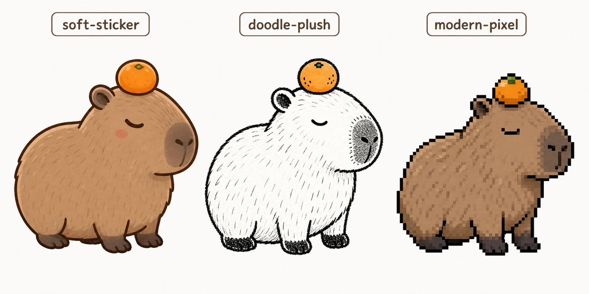

# custom-codex-pet-styles (´｡• ᵕ •｡`)

上传参考图，从三种风格里选一种，自动生成你的专属 Codex 宠物。
Codex 宠物是 Codex 应用里的可选动画伴侣，以悬浮窗口的形式显示当前任务进度，
反映 Codex 正在运行、等待输入还是等待审查，让你不用打开线程就能随时瞄一眼状态。

Upload a reference image, pick one of three styles, and get your own Codex pet.
Codex pets are optional animated companions that float over other apps,
showing your active thread and reflecting whether Codex is running,
waiting for input, or ready for review.

---

### 这个 skill 做什么 / What this skill does

`$hatch-pet` 是官方的宠物生成 skill，但风格由 AI 自由发挥。
这个 skill 在它的基础上提供三种精心设计的可爱风格，让你的宠物更有个性。

`$hatch-pet` is the official pet-creation skill, but it picks the style on its own.
This skill wraps it with three curated styles so you get a cuter, more intentional result.

---

### 三种风格 / Styles (ﾉ◕ヮ◕)ﾉ*:･ﾟ✧



**soft-sticker / 软萌扁平贴纸风**
圆润可爱，像贴纸。
Soft rounded kawaii flat-vector.

**doodle-plush / 黑白手绘涂鸦风**
黑白线条，手绘感。
Inky hand-drawn doodle, mostly black and white.

**modern-pixel / 现代像素宠物风**
干净像素，像桌面小精灵。
Crisp pixel art, not retro arcade.

---

### 前置条件 / Prerequisites

确保 `$hatch-pet` 已安装，如果没有：
Make sure `$hatch-pet` is installed. If not:

```
$skill-installer hatch-pet
```

安装后按 Cmd+K / Ctrl+K，选 Force Reload Skills 重载。
After installing, press Cmd+K / Ctrl+K and choose Force Reload Skills.

---

### 用法 / Usage

1. 上传参考图，或文字描述你的角色。
   Upload a reference image, or describe your character in text.

2. 选风格；不确定可以让 skill 生成三种预览对比图。
   Choose a style — or ask for a side-by-side preview of all three first.

3. 确认 brief 后，skill 会自动调用 `$hatch-pet` 完成制作。
   Approve the brief and `$hatch-pet` takes it from there.

> 文字描述也能用，但效果通常不如有参考图。
> Text-only works, but results are usually less faithful than image-grounded pets.

---

### 安装 / Install

```bash
codex skill install https://github.com/keni112403/custom-codex-pet
```
